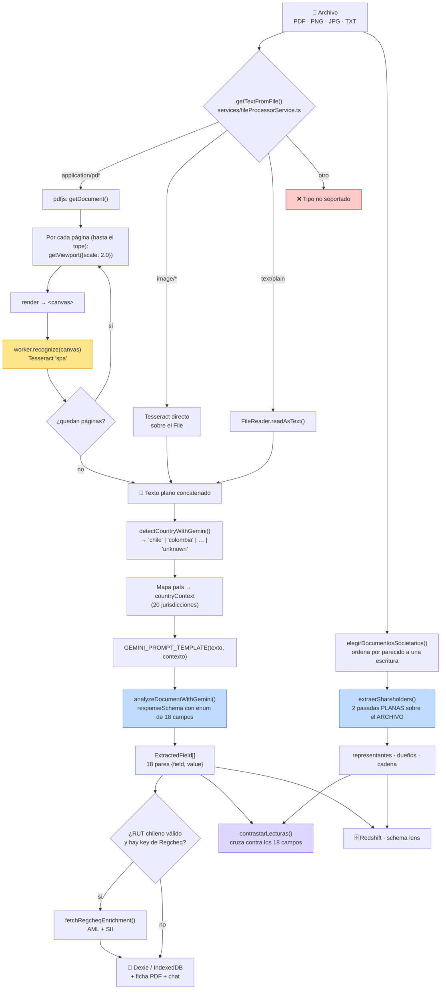

# Analizador de Documentos — documentación técnica e integración

El módulo núcleo de Lens: toma una escritura (PDF o imagen), la convierte a
texto, y le pide a Gemini una ficha estructurada de **18 campos**.

Desde septiembre hace además una **segunda extracción**, independiente de esos
18: la **composición societaria** —representantes, dueños directos y la cadena
de las jurídicas— leyendo el archivo nativo. Es §5.

Este documento sirve para dos cosas: entender **cómo funciona** (§1–§7) y tener
todo lo necesario para **integrarlo** en otro sistema (§8–§12).

> **Actualizado el 17-09-2026.** La versión anterior (31-08) describía solo el
> pipeline de los 18 campos y decía "hoy no hay API". Las dos cosas cambiaron.

Arquitectura general de la suite: [ARQUITECTURA_LENS.md](ARQUITECTURA_LENS.md).

---

## 1. El pipeline, de punta a punta



**Hay DOS lecturas del mismo documento, y son independientes a propósito.** Los
18 campos salen del **texto** extraído; la composición societaria sale del
**archivo nativo**, con otro prompt y otro esquema. Donde coinciden hay confianza
alta; donde difieren, alguna está adivinando — y eso es lo que mide el paso
violeta (§5.4).

**El paso caro es el amarillo.** No hay OCR en la nube: es pdfjs renderizando
cada página a canvas en escala 2.0 y Tesseract reconociéndola **dentro del
navegador**, con **un solo worker compartido** por toda la app. Todo hace fila
ahí.

**El único paso con modelo es el azul.** De ahí en adelante —en la cola KYB— la
comparación, los pesos y las alertas son código determinista.

---

## 2. Paso 1 — Extracción de texto

`services/fileProcessorService.ts`

### Contrato

```ts
export interface OpcionesTexto {
  maxPaginasOcr?: number;                                  // 0/undefined = sin tope
  onTope?: (leidas: number, total: number) => void;        // avisa si recortó
}

export const getTextFromFile = (
  file: File,
  onProgress?: (progress: number, status: string) => void, // progress 0..100
  opciones?: OpcionesTexto,
) => Promise<string>;

export const terminateTesseractWorker = () => Promise<void>;
```

### Tipos aceptados

| MIME | Camino |
|---|---|
| `application/pdf` | pdfjs → canvas → Tesseract, página por página |
| `image/png`, `image/jpeg`, `image/jpg` | Tesseract directo sobre el `File` |
| `text/plain` | `FileReader`, sin OCR |
| cualquier otro | Rechaza: `Tipo de archivo no soportado (…)` |

### Códigos de error

Se lanzan como `Error` con estos mensajes/prefijos:

| Código | Cuándo |
|---|---|
| `PDF_ZERO_PAGES` | El PDF abrió pero tiene 0 páginas |
| `OCR_NO_TEXT_DETECTED` | Se recorrió todo el PDF y no salió una sola letra |
| `OCR_NO_TEXT_DETECTED_IMG` | Idem para imagen (se re-lanza en castellano) |
| `OCR_CANVAS_CONTEXT_ERROR` | No se pudo obtener el contexto 2D del canvas |
| `OCR_INIT_ERROR[_IMG]` | No cargó el script de OCR o el idioma (red / CDN) |
| `OCR_PROCESSING_ERROR[_IMG]` | Cualquier otra falla de Tesseract |

### Tres cosas que hay que saber antes de integrarlo

**1. No usa la capa de texto del PDF.** El pipeline OCR'ea **siempre**, incluso
cuando el PDF trae texto embebido (los del Conservador y las notarías modernas lo
traen). `page.getTextContent()` existe en `pdfjs` y en el repo solo lo usa
`manualService.ts`. Añadir un intento de capa de texto antes del OCR es **la
mejora de rendimiento más grande disponible** y es barata: extracción exacta, sin
error de reconocimiento, y se saltea el paso caro entero.

**2. Depende de dos CDN.** El worker de pdfjs se carga de
`https://esm.sh/pdfjs-dist@<version>/build/pdf.worker.js` (línea 5 del archivo) y
Tesseract 5 descarga su core y el `spa.traineddata` de jsDelivr por defecto. En
una red cerrada o con CSP estricta hay que **hospedar los dos localmente** o el
módulo falla con `OCR_INIT_ERROR`.

**3. El tope de páginas es opcional y por defecto no limita.** El Lens clásico lee
el documento entero. La cola KYB pasa `maxPaginasOcr: 15` porque el OCR de una
escritura escaneada de 40 páginas se comía el presupuesto por empresa —medido, el
corte más frecuente era `Lectura de documentos: no respondió en 240s`. Se leen las
**primeras** N: en una escritura la identidad (RUT, razón social, comparecencia,
capital, objeto social) está al principio y las últimas páginas son firmas y
timbres. **El recorte se reporta siempre** vía `onTope` y termina en los
`faltantes` de la ficha: un documento leído parcial se dice, no se esconde.

---

## 3. Paso 2 — Detección de país

`detectCountryWithGemini(texto)` devuelve una clave en minúscula de
`KEYWORDS_BY_COUNTRY` o `'unknown'`. Esa clave indexa un mapa de **20
jurisdicciones** en `DocumentAnalyzer.tsx` que produce el `countryContext`: una
frase que le dice al modelo qué vocabulario legal usar (RUT/SpA para Chile,
NIT/SAS para Colombia, RUC/SAC para Perú, CNPJ para Brasil, 统一社会信用代码 para
China…) y si tiene que **traducir al español**.

En el modo batch este paso se **saltea** cuando EmpresaDocs ya trae el país: una
llamada menos por empresa.

---

## 4. Paso 3 — Extracción con Gemini

`services/geminiService.ts` · prompt en `constants.ts`

```ts
export const analyzeDocumentWithGemini = (prompt: string) => Promise<{
  extractedData: ExtractedField[];   // SIEMPRE los 18, en orden
  rawResponse: string;
}>;

export interface ExtractedField { field: string; value: string }
```

### Configuración del modelo

| Parámetro | Valor |
|---|---|
| Modelo | `gemini-3.5-flash` (extracción y chat) |
| `responseMimeType` | `application/json` |
| `responseSchema` | Array de `{field, value}`, con `field` restringido por **enum** a los 18 nombres |
| `thinkingConfig.thinkingBudget` | `0` — sin razonamiento extendido, es una tarea de extracción |
| Reintentos | 3 intentos, backoff 1,2 s → 2,4 s |

**Garantía de forma.** El `responseSchema` con enum hace que el modelo no pueda
inventar nombres de campo. Y el servicio **rellena los faltantes**: la salida
siempre trae los 18, con `"No especificado"` donde no hubo dato. Quien consuma
esto no necesita defenderse de campos ausentes.

**Clasificación de errores.** `executeWithRetry` separa permanentes
(`api key not valid`, `quota` → no reintenta) de transitorios (`failed to fetch`,
`timeout`, `overloaded`, `429`, `5xx` → reintenta). El mensaje final que sale es
en castellano y ya interpretado.

### Los 18 campos

`PREDEFINED_FIELDS` en `constants.ts`:

```
 1 RUT de la sociedad              10 Domicilio Legal
 2 Razón Social                    11 Facultades
 3 Fecha de Constitución           12 Juntas de Accionistas
 4 Objeto Social                   13 Resolución de Conflictos
 5 Capital Social                  14 Distribución de Utilidades
 6 Acciones                        15 Medio de Comunicación
 7 Accionistas y aportes           16 ¿Empresa con fines de lucro?
 8 Representante Legal             17 Documento contains modificaciones?
 9 Duración                        18 Análisis de Facultades Específicas
```

> El campo 17 tiene un typo en inglés (`contains`) heredado. **No lo renombres
> sin migrar**: es literal del enum del schema y de las fichas ya guardadas en
> IndexedDB.

### Dos formatos de salida que no son texto libre

Estos dos existen porque **alimentan la comparación automática de la cola KYB**.
Si integrás el analizador y querés cruzar contra otro registro, respetalos.

**Personas — `Representante Legal` y `Accionistas y aportes`.** Una persona por
línea, tres columnas separadas por `|`:

```
NOMBRE COMPLETO | DOCUMENTO | DATO
```

```
JUAN ANDRÉS PÉREZ SOTO   | 12.345.678-9 | 50%
MARÍA JOSÉ GONZÁLEZ RUIZ | 9.876.543-2  | 50%
```

El `DATO` es el **porcentaje** para accionistas y el **cargo** para
representantes. Sin documento → literal `sin documento`; sin porcentaje →
`sin porcentaje`. El prompt insiste en tres reglas que salieron de fallas
medidas: no abreviar ni cortar apellidos, **separar en líneas distintas a las
personas nombradas juntas** ("Juan Pérez y María Soto"), y **nunca inventar,
completar ni corregir un dígito** de un documento ilegible.

**Facultades específicas — campo 18.** Un JSON *stringified*:

```json
{"compraVentaBienes": true, "operacionesBancarias": false, "mandatos": true}
```

### Efecto medido del prompt de personas

Línea base sobre la cola KYB, antes del bloque de instrucciones de personas:

| Métrica | Antes | Después |
|---|---|---|
| Socios fantasma (líneas que no eran personas) | 57 % | **0 %** |
| Personas con documento extraído | 28 % | **100 %** |
| Accionistas con porcentaje | 0 % | **60 %** |

*(261 personas sobre 67 empresas en la base; 2 corridas post-cambio.)*

---

## 5. La composición societaria — la segunda extracción

**No toca los 18 campos.** Es una extracción aparte, con su propio prompt, su
propio esquema y su propia salida. Los 18 siguen saliendo del camino de texto
exactamente igual que antes.

Llena el contrato `BusinessShareholders` que ms-company ya consume, y por eso
existe: Lens absorbe al bot que lo hacía antes.

### 5.1 Qué documento se le manda, y por qué van todos

Se le manda el **archivo nativo**, no su texto: las tablas de propiedad se leen
mucho mejor con el PDF a la vista que con el texto aplanado.

Y van **todos** los documentos que el modelo pueda ver, ordenados. Mandar uno
solo perdía datos, y no de a poco — medido sobre 87 análisis de producción en
los que el camino de texto SÍ encontró accionistas:

| | con dueños en el texto | los perdió la estructurada |
|---|---|---|
| 1 archivo | 60 | 3 · **5 %** |
| varios archivos | 27 | 17 · **63 %** |

Doce veces peor en los consolidados. La causa: el camino de texto concatena
todos los documentos y este mandaba uno. En un consolidado la escritura
constituye y el anexo trae la composición vigente, así que la tabla estaba en un
archivo que el modelo nunca veía.

El orden lo decide `elegirDocumentosSocietarios()`, por qué tanto se parece cada
archivo a una escritura:

| rango | tipo | patrón |
|---|---|---|
| 0 | escritura | `deeds` · escritura · constitución |
| 1 | cámara de comercio | `trade_chamber` |
| 2 | nombre libre | subidas manuales, sin señal |
| 3 | anexo | `complementary` |
| 4 | identidad | `id_document` · `legal_representative` |

Un **anexo conocido pierde contra un nombre desconocido**, y no es arbitrario: de
un `complementary` sabemos que es secundario; de un nombre libre no sabemos nada
y bien puede ser el principal. Caso real: dos `complementary` y un
«MATRICULA DE COMERCIO VALIDADO.pdf», que era el que traía la composición.

### 5.2 Dos pasadas PLANAS, y por qué no una anidada

1. representantes + todos los dueños de la tabla (naturales y jurídicas)
2. por **cada** jurídica, una pregunta propia: ¿quiénes son sus socios?

El esquema es plano en las dos. **No es estilo, es una medición:** con el
esquema anidado, sobre 8 corridas del mismo documento la cadena salía 6 de 8, y
una de cada cinco se desbocaba hasta 45.358 tokens de salida devolviendo JSON
truncado. Las corridas malas eran exactamente las que tocaban el tope de salida.

Con dos pasadas planas: 8 de 8, cero JSON roto, salida estable en ~640 tokens.
**Hay un test que falla si alguien vuelve a anidar el esquema.**

### 5.3 La regla de oro, y quién la cumple

```
NATURAL en la tabla            → directOwnership
JURÍDICA en la tabla           → indirectShareholders, en la raíz
NATURAL detrás de una jurídica → indirectShareholders, anidada
```

El reparto lo hace **este código** a partir de `personType`, NO el modelo. Así la
regla se cumple por construcción y deja de depender de que el modelo la respete.

### 5.4 Las señales, y el límite de cada una

| señal | qué detecta |
|---|---|
| `sumaParticipacion` | que se haya colado la tabla de OTRA empresa: la suma da 200 |
| `juridicasConCadena` | cuántas jurídicas revelaron su composición |
| `juridicasEnNivel1` | la cadena sigue más abajo de lo que el contrato representa |
| `contrastarLecturas` | las dos lecturas del documento no dan los mismos documentos |

**`participacionSospechosa` NO detecta la alucinación de un solo socio**, y es
importante saberlo antes de apoyarse en ella. Medido contra Gemini: cuando al
modelo le falta la tabla no dice «no sé» — le adjudica el **100 % al único socio
que ve**. Eso suma 100, sale `false`, y cumple las tres restricciones de la regla
de oro. El dato inventado es internamente consistente y ninguna señal estructural
lo delata.

Lo único que lo agarra es el **contraste entre las dos lecturas**. Cruzado sobre
104 análisis de producción: 44 coincidían y **3 no** — y dos de esos tres
diferían en **un solo dígito** de un documento de identidad:

```
texto 273340386   estructurada 223340386
texto  60894493   estructurada  60894413
```

No son dos personas distintas: es una de las dos lecturas inventando un dígito. A
la hora de screenear, eso es otra persona.

El contraste **no corrige ni elige ganador**. Sin volver al papel no hay forma de
saber cuál tiene razón, y elegir en silencio sería fabricar la certeza que este
control existe para negar. Marca, cuenta, y queda en la ficha.

### 5.5 Dónde queda

En `lens.analisis_persona` (una fila por persona, con `rol`, `nivel` y
`persona_padre_uid` para la cadena) y, como marca, dentro de la ficha:

```jsonc
"shareholders": { "ok": true, "personas": 4, "senales": {…}, "contraste": {…} }
"shareholders": { "ok": false, "error": "…no es JSON válido." }
```

Esa marca existe porque **`analisis_persona` vacía era ambigua**: podía ser "se
ejecutó y falló" o "el código nunca llegó a esa pestaña", y desde afuera no se
distinguían.

---

## 6. Paso 4 — Lo que pasa después de la ficha

| Qué | Cuándo | Dónde |
|---|---|---|
| **Enriquecimiento Regcheq** (AML + SII) | Se extrajo un RUT chileno válido (`/^[0-9]{7,8}[0-9K]$/`) y hay `VITE_REGCHEQ_API_KEY` | `regcheqEnrichment.ts` |
| **Resumen ejecutivo** | Al descargar la ficha PDF | `generateExecutiveSummary()` |
| **Ficha PDF** | A pedido | `pdfGenerator.ts` |
| **Chat sobre el documento** | A pedido | `getChatResponse()` con el texto crudo como contexto |
| **Análisis de riesgo / integridad** | A pedido, botón aparte | `analyzeDocumentForRisks()` / `analyzeDocumentIntegrity()` |
| **Persistencia local** | Siempre | Dexie `db.documents` — local al navegador |
| **Persistencia en Redshift** | Siempre | schema `lens` — ver `LENS_REDSHIFT_SCHEMA.md` |
| **Composición societaria** | Si hay un PDF/JPG/PNG | §5 — `shareholdersService.ts` |

El enriquecimiento Regcheq **no depende de la detección de país**: le alcanza con
un RUT chileno bien formado. Fue deliberado, porque para el SII basta el RUT.

---

## 7. Concurrencia y estado

- **Una ficha a la vez.** `DocumentAnalyzer` procesa la cola de a un job, con un
  lock entre pestañas en `localStorage` (`lens_ai_processing_lock`): si hay dos
  pestañas abiertas, la segunda espera.
- **Dentro de un job consolidado**, los archivos se lanzan con `Promise.all`,
  pero el **worker de Tesseract es uno solo y compartido**, así que el OCR
  serializa igual. El paralelismo real es sobre la descarga, no sobre el
  reconocimiento.
- ⚠️ **`activeProgressCallback` es una variable de módulo única.** Con varias
  extracciones en vuelo los reportes de progreso se pisan entre sí. Afecta solo
  a lo que se muestra, no al texto extraído — pero si integrás con progreso por
  archivo, esto hay que arreglarlo primero.

---

## 8. Cómo lo usa la cola KYB (el consumidor más exigente)

`services/kyb/kybAnalysisService.ts` → `analizarEmpresa(companyId, opciones)`

```
1. Admin        getEmpresaDocsCompany()            tope 120 s
2. Documentos   descarga (pool de 4) →
                processOneCompany() con maxPaginasOcr: 15
                presupuesto = nDocs × 60 s, entre 240 s y 900 s
3. Screening    Regcheq por sujeto                 tope 180 s
4. Comparación  compararKyb() — 8 componentes      puro
5. Alertas      evaluarAlertas() — 35 alertas      puro
6. Certidumbre  calcularCertidumbre()              puro
7. Persistencia kyb_empresas/{id}/analisis/{runId}
```

Tres reglas de este orquestador que conviene copiar si integrás algo parecido:

- **El presupuesto de OCR es por documento, no por empresa.** Antes eran 240 s
  fijos: una empresa con 8 documentos tenía 30 s por documento y una con 1 tenía
  240 s para el mismo trabajo.
- **Un corte por tiempo no invalida la corrida.** Va a `INCOMPLETO`, no a
  `ERROR`: los datos de Admin ya se leyeron y sus componentes pueden puntuar.
  `ERROR` queda para lo que de verdad significa "volvé a correrlo".
- **La extracción cruda se guarda antes de mapear.** El mapeo descarta lo que no
  matchea una regla, y esa pérdida era definitiva.

---

## 9. Integración

> **Esto cambió: LA API EXISTE.** La versión anterior de este documento decía
> "hoy no hay API" y proponía un contrato. Se construyó, está desplegada y se usa.

### Camino B — La API HTTP (el recomendado) ✅ EN PRODUCCIÓN

`aws/lens-api/` — Lambda `lens-analisis` con Function URL. Es el mismo pipeline
de los 18 campos expuesto por HTTP, para que lo consuma cualquier lenguaje.

```http
POST /v1/analisis
x-api-secret: <secreto>
Content-Type: application/json

{ "documentos": [ { "nombre": "escritura.pdf", "contenido_base64": "…" } ] }
```

Devuelve los 18 campos, el país detectado, el detalle por documento y `avisos`.
También acepta `multipart/form-data` y descarga por URL (desactivada por defecto:
sin lista de dominios sería un SSRF).

**Tres cosas que la API hace distinto de la SPA, y conviene saber:**

| | SPA | API |
|---|---|---|
| Lectura del PDF | OCR siempre (Tesseract en el navegador) | **capa de texto primero**, OCR solo para escaneos |
| Prompts | `constants.ts` | generados LEYENDO `constants.ts` — nunca se copian |
| Corte por tiempo | no hay | presupuesto de 260 s → devuelve lo leído con `INCOMPLETO` |

Los prompts no se copian a mano: `scripts/generar_prompts.py` lee `constants.ts`
en modo solo lectura y genera el módulo Python. Un `--check` falla el despliegue
si alguien tocó un prompt allá y no regeneró. Es lo único que garantiza que las
dos puntas devuelvan lo mismo.

> ⚠️ **`POST /v1/analyses` —el contrato `BusinessShareholders` con la composición
> societaria— está escrito y probado, pero NO DESPLEGADO.** El stack quedó en
> `UPDATE_ROLLBACK_FAILED` y `compliance-admin` no tiene los permisos de IAM ni
> de CloudFormation para destrabarlo. Detalle en `aws/lens-api/PERMISOS.md`.
> Hoy lo que responde es `/v1/analisis`, la ruta de los 18 campos.

### Camino A — Importar los módulos en otra app web

El más rápido si el consumidor también es una SPA.

**Lo que se importa (3 archivos, sin React):**

```ts
import { getTextFromFile } from './services/fileProcessorService';
import { analyzeDocumentWithGemini, detectCountryWithGemini } from './services/geminiService';
import { GEMINI_PROMPT_TEMPLATE, PREDEFINED_FIELDS } from './constants';

const texto  = await getTextFromFile(file, onProgress, { maxPaginasOcr: 15 });
const pais   = await detectCountryWithGemini(texto);
const prompt = GEMINI_PROMPT_TEMPLATE(texto, contextoDe(pais));
const { extractedData } = await analyzeDocumentWithGemini(prompt);
```

**Lo que hay que resolver:**

| Requisito | Detalle |
|---|---|
| `process.env.API_KEY` | `geminiService` lo lee de ahí. Con Vite se inyecta en `define:`; con otro bundler hay que replicarlo |
| Dependencias | `@google/genai`, `pdfjs-dist@4`, `tesseract.js@5` |
| CDN | Hospedar `pdf.worker.js` y `spa.traineddata` si la red es cerrada |
| DOM | Necesita `document.createElement('canvas')` y la File API |
| `countryContext` | El mapa de 20 jurisdicciones **vive dentro de `DocumentAnalyzer.tsx`**. Hay que extraerlo a `constants.ts` para poder reusarlo — es el único refactor obligatorio de este camino |

### ~~Camino B (propuesta)~~ — cómo quedaron las decisiones que proponía

Esta sección proponía un contrato HTTP y dos decisiones técnicas. **Se
construyó** (arriba), y las dos decisiones se tomaron — se deja el registro
porque explica por qué la API no es un puerto literal de la SPA:

| Lo que se proponía | Cómo quedó |
|---|---|
| Contrato `POST /v1/documentos/analizar` | Quedó como **`POST /v1/analisis`**, con `documentos[]` en JSON o multipart |
| «Agregar la capa de texto como camino primario» | **Hecho.** Medido sobre un PDF digital real de 41 páginas: 0 páginas por OCR, 1.027 ms de extracción |
| «Evaluar reemplazar Tesseract por un OCR de servidor» | **Hecho:** Textract. Tesseract se había elegido para que el documento no saliera del navegador; en un servicio propio esa restricción no aplica |
| `extractTextFromPdfWithOcr` no corre en Node (usa `canvas`) | Por eso la API **no portó ese archivo**: se reescribió con `pypdf` + Textract en vez de arrastrar `@napi-rs/canvas` |

La consecuencia práctica de la capa de texto: la mayoría de las escrituras que
llegan son PDF digitales, así que **la API casi nunca toca el OCR** y responde en
segundos. La SPA sigue con Tesseract siempre (deuda #1 de §11).

### Camino D — Leer lo que ya quedó en Redshift

Todo análisis —de la SPA, del batch y de la API— persiste en el schema `lens`.
Si el consumidor solo necesita **consultar resultados**, no hace falta integrar
nada ni volver a pagar tokens.

| tabla | qué tiene | vista en inglés |
|---|---|---|
| `lens.analisis` | una fila por ejecución: quién, cuándo, cuánto costó | `lens.analysis` |
| `lens.analisis_campo` | los 18 campos, formato largo | `lens.analysis_field` |
| `lens.analisis_persona` | representantes, dueños y la cadena (§5) | `lens.analysis_person` |
| `lens.analisis_ficha` | la ficha completa en SUPER, para recalibrar | `lens.analysis_record` |
| `lens.analisis_revision` | análisis marcados para revisión humana | `lens.analysis_review` |

Detalle en `LENS_REDSHIFT_SCHEMA.md` y `LENS_MODELO_DATOS_Y_PERSONAS.md`.

> El cluster **se pausa de 18:30 a 04:00** y el job que lo levanta corre de lunes
> a viernes. Un fin de semana no hay datos: no es una caída.

### Camino C — Consumir lo que la cola KYB ya deja en Firestore

Si el consumidor solo necesita **el resultado** de empresas que Lens ya analizó,
no hace falta integrar nada: está en Firestore.

```
kyb_empresas/{companyId}                     ficha y estado
kyb_empresas/{companyId}/analisis/{runId}    cada corrida completa
kyb_empresas/{companyId}/snapshot/admin      último snapshot de Admin
```

Cada `analisis/{runId}` trae la extracción cruda de los 18 campos, los 8
componentes con su estado y puntaje, las 35 alertas, la certidumbre con sus
razones línea por línea, y los `faltantes`. Es de solo lectura y ya está
auditado.

---

## 10. Rendimiento — dónde se va el tiempo

| Fase | Orden de magnitud | Comentario |
|---|---|---|
| Descarga del documento | segundos | Pool de 4 en paralelo (KYB) |
| **OCR** | **minutos** | ~1 render + 1 reconocimiento por página. **El cuello de botella** |
| Detección de país | ~1 s | 1 llamada a Gemini; se saltea si el país ya se conoce |
| Extracción | ~2–5 s | 1 llamada a Gemini |
| Comparación + alertas + certidumbre | milisegundos | Código puro, sin red |
| Admin (KYB) | 0,7–1,3 s | Medido de a una empresa |

Los presupuestos configurados en `kybAnalysisService.ts` son la mejor referencia
empírica que hay: 60 s por documento, piso 240 s, techo 900 s.

---

## 11. Deuda conocida del módulo

| # | Qué | Impacto |
|---|---|---|
| 1 | **En la SPA** no se intenta la capa de texto: OCR siempre | El más caro. La API ya lo resolvió (§9); la SPA no |
| 2 | `activeProgressCallback` es global | Progreso cruzado entre extracciones concurrentes |
| 3 | `services/ocrWorkerService.ts` es código muerto | Nadie lo importa; confunde al que llega |
| 4 | El mapa de 20 jurisdicciones vive dentro del componente React | Bloquea reusar la extracción fuera de la UI |
| 5 | Campo 17 con typo en inglés (`Documento contains modificaciones?`) | No se puede renombrar sin migrar el enum y las fichas guardadas |
| 6 | Fichas solo en IndexedDB local | No se comparten entre analistas; export/import JSON a mano |
| 7 | La key de Gemini viaja en el bundle público | Registrado; se resuelve al mover al AWS corporativo |
| 8 | `POST /v1/analyses` está escrito y **sin desplegar** | El stack quedó en `UPDATE_ROLLBACK_FAILED`; ver `aws/lens-api/PERMISOS.md` |
| 9 | El acceso a S3 del bucket `g66-company` necesita **las dos puntas** | La nuestra está en el template; falta la bucket policy del dueño |
| 10 | `participacionSospechosa` no detecta la alucinación de un solo socio | §5.4. Solo lo agarra el contraste entre las dos lecturas |
| 11 | La cadena societaria solo representa **dos niveles** | Una jurídica detrás de otra se aplana; se cuenta en `juridicasEnNivel1` |

---

## 12. Archivos de referencia

| Archivo | Qué contiene |
|---|---|
| `services/fileProcessorService.ts` | OCR y extracción de texto. **Empezá acá** |
| `services/geminiService.ts` | Todas las llamadas al modelo, reintentos, tracking de tokens |
| `constants.ts` | `PREDEFINED_FIELDS` y todos los prompts |
| `components/DocumentAnalyzer.tsx` | Orquestación de la UI individual + mapa de países |
| `services/batchProcessor.ts` | `processOneCompany()` — el pipeline reusable, sin React |
| `services/kyb/kybAnalysisService.ts` | El consumidor más exigente: topes, presupuestos, estados |
| `types.ts` | `ExtractedField`, `ProcessedDocument`, `FileProcessingStatus` |
| `services/shareholdersService.ts` | §5 completa: elección de documentos, dos pasadas, contraste |
| `services/lensPersistenciaService.ts` | Las filas que van al schema `lens` de Redshift |
| `aws/lens-api/` | La API HTTP. `README.md` ahí adentro tiene el contrato |
| `aws/lens-api/scripts/generar_prompts.py` | Lee `constants.ts` y genera los prompts de la API |
| `aws/colas-logger/sql/lens_vistas_en.sql` | Las vistas en inglés sobre el schema `lens` |

## Documentos relacionados

| Archivo | Qué cubre |
|---|---|
| `ARQUITECTURA_LENS.md` | La suite completa: módulos, infra, quién habla con quién |
| `LENS_REDSHIFT_SCHEMA.md` | El schema `lens` tabla por tabla |
| `LENS_MODELO_DATOS_Y_PERSONAS.md` | Cómo se modelan las personas y la cadena societaria |
| `PLAN_ABSORCION_SHAREHOLDERS.md` | Las 6 fases de la absorción del bot, y qué cerró cada una |
| `aws/lens-api/PERMISOS.md` | Lo que `compliance-admin` NO puede hacer, medido |
