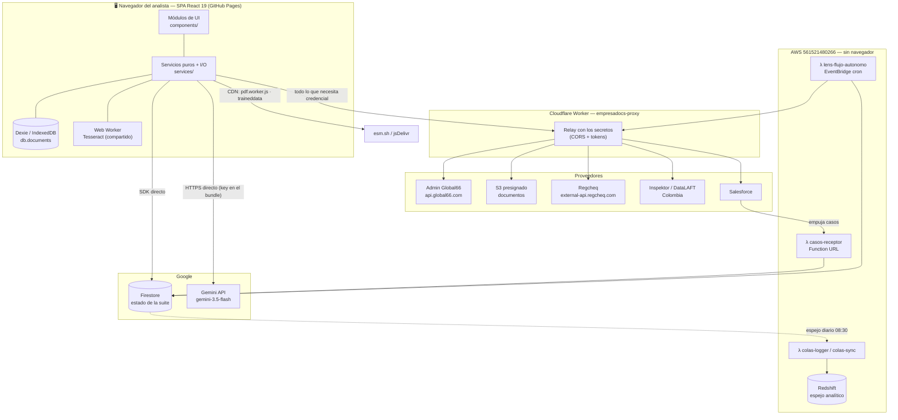

# Arquitectura de Lens AI — documentación técnica

Suite de herramientas de Compliance de Global66. Este documento describe **cómo
está construida** y **por qué**. Para el detalle del analizador de documentos y
su integración, ver [ANALIZADOR_DOCUMENTOS_DOC.md](ANALIZADOR_DOCUMENTOS_DOC.md).

Documentos hermanos: [REGCHEQ_MODULE_DOC.md](REGCHEQ_MODULE_DOC.md),
[INSPEKTOR_MODULE_DOC.md](INSPEKTOR_MODULE_DOC.md),
[COLAS_TRABAJO_ARQUITECTURA.md](COLAS_TRABAJO_ARQUITECTURA.md),
[KYB_MATRIZ_CONFIGURACION.md](KYB_MATRIZ_CONFIGURACION.md).

---

## 1. Qué es, en una frase

Lens es una **SPA que corre entera en el navegador**. No hay backend propio de
aplicación: el navegador habla directamente con Firestore, con Gemini y —para
todo lo que necesita credencial— con un **Worker de Cloudflare** que actúa de
relay y guarda los secretos. Aparte, y sin navegador, hay una capa en AWS que
ejecuta los procesos automáticos.

Consecuencia práctica: **el documento del cliente nunca pasa por un servidor
nuestro**. Se descarga al navegador del analista, se OCR'ea ahí, y solo el
**texto** sale hacia Gemini.

---

## 2. Stack

| Capa | Tecnología |
|---|---|
| UI | React 19 + TypeScript 5.8 + Tailwind (CDN) |
| Build | Vite 6, `base: '/lens-ai/'` |
| Deploy | GitHub Pages vía GitHub Actions |
| Estado remoto | Firebase / Firestore (`firebase` 12.x) |
| Estado local | Dexie 4 (IndexedDB) + `localStorage` |
| IA | `@google/genai` 1.x → **`gemini-3.5-flash`** |
| OCR | `tesseract.js` 5.1 (idioma `spa`) |
| PDF lectura | `pdfjs-dist` 4.0.379 |
| PDF escritura | `jspdf` 3 + `jspdf-autotable` 5 |
| Otros | `xlsx`, `jszip`, `recharts`, `lucide-react`, `html2canvas` |
| Relay de secretos | Cloudflare Worker (`empresadocs-proxy`) |
| Procesos automáticos | AWS SAM / Lambda + EventBridge + Redshift Data API |

---

## 3. Diagrama de arquitectura

### Lo que el diagrama no dice y hay que saber

- **Un solo ejecutor por proceso.** La app *muestra y dispara*; el Lambda
  *ejecuta*. Cuando los dos cerraban casos hubo **69 cierres duplicados en
  producción**. Por eso el flujo autónomo vive en AWS y la UI solo lo consulta.
- **El Worker no es un backend**, es un relay: no tiene lógica de negocio, no
  persiste nada. Existe por dos razones: los proveedores no mandan CORS, y los
  tokens no pueden vivir en un bundle público.
- **El bundle es público.** Lo que se define en `vite.config.ts` con `define:`
  queda literal en el JS servido. Ver §7.

---

## 4. Módulos de la suite

`components/AppLauncher.tsx` expone ocho suites, con gate por permiso
(`userProfile.modules.*`).

| Suite | Componente | Qué hace |
|---|---|---|
| **Compliance** | `ComplianceLens.tsx` | Contenedor de: Analizador de Documentos, Límites Transaccionales, Lens Crypto, Evaluador AML, Dashboard |
| Analizador de Documentos | `DocumentAnalyzer.tsx` | **El núcleo.** PDF/imagen → OCR → Gemini → ficha de 18 campos + chat. Ver doc dedicada |
| Análisis masivo | `BatchAnalyzer.tsx` | El mismo pipeline sobre N empresas (carpeta local o EmpresaDocs) |
| Límites Transaccionales | `TransactionalLimits.tsx` | Lectura de cartolas/estados financieros |
| Lens Crypto | `CryptoLens.tsx` | Perfilamiento forense de wallets |
| **Perfiles Criminales** | `CriminalProfiler/` | Chile (Regcheq) y cola desde Salesforce |
| **Inspektor Colombia** | `InspektorColombia.tsx` | AML/judicial Colombia + modelo criminal por capas |
| **Regcheq AML/KYC** | `RegcheqTool.tsx` | Consulta individual y masiva |
| **Vista 360°** | `Lens360.tsx` | Consolidado en vivo por RUT, sin persistencia |
| **Cola KYB Empresas** | `KybQueue/` | Cola de trabajo B2B: Admin + documentos → matriz de 8 componentes |
| **Bandeja de Casos** | `CasosInbox.tsx` | Casos que Salesforce empuja a Firestore |
| **Admin** | `AdminModule.tsx` | Usuarios, roles, mantenedores de flujo |

---

## 5. Persistencia

### Firestore

| Colección | Contenido |
|---|---|
| `casos_sf` | Casos OFAC/PEP que Salesforce empuja. Subcolección `auditoria` (sin payload ni DNI) |
| `kyb_empresas` | Cola B2B. Subcolecciones: `analisis/{runId}` (cada corrida) y `snapshot/admin` |
| `flujo_autonomo_corridas` | Historial de corridas del flujo automático |
| `config` | Mantenedores: `flujoAutomatico`, flujo KYB, catálogos |
| `users`, `invitations` | Auth y roles |
| `analytics`, `token_events` | Uso y consumo de tokens de Gemini |

### Local al navegador

- **Dexie / IndexedDB** (`LensAIDatabase.documents`): las fichas del Analizador
  de Documentos. **No se sincronizan**: viven en la máquina del analista, y se
  exportan/importan como JSON a mano.
- **`localStorage`**: lock de procesamiento entre pestañas
  (`lens_ai_processing_lock`), preferencias de UI.

---

## 6. El Worker: rutas

`cloudflare/empresadocs-proxy/src/index.ts`. Base:
`https://empresadocs-proxy.bmackenna.workers.dev`.

| Ruta | Destino | Para qué |
|---|---|---|
| `/relay?url=…` | cualquiera | Descarga de S3 presignado sin CORS |
| `/admin/customer-status` | Admin | Estado de cliente |
| `/admin/transaction-status` | Admin | Estado de transacción |
| `/admin/company-sweep` | Admin | Barrido de empresas para la cola KYB |
| `/regcheq/sii` | Regcheq | Dispara el SII con el token de sesión centralizado |
| `/inspektor/*` | Inspektor | Passthrough (login + `ConsultaPrincipal`) |
| `/salesforce/casos-cola` | Salesforce | Lectura de la cola |
| `/salesforce/case-update` | Salesforce **producción** | Cierre de casos |
| `/flujo/cron`, `/flujo/correr` | Lambda | Dispara el flujo autónomo |
| `/colas/log` | Lambda → Redshift | Espejo analítico de la gestión |

Redeploy: `cloudflare/empresadocs-proxy/setup.sh` (lee los secretos de archivo,
nunca del prompt).

---

## 7. Configuración

`vite.config.ts` inyecta en build-time. **Todo lo que esté acá queda en el
bundle público.**

| Variable | Uso |
|---|---|
| `GEMINI_API_KEY` | → `process.env.API_KEY`. La usa `geminiService` |
| `FIREBASE_API_KEY` / `_AUTH_DOMAIN` / `_PROJECT_ID` / `_APP_ID` | Firestore + Auth |
| `EMPRESADOCS_PROXY_URL` | Base del Worker |
| `VITE_REGCHEQ_API_KEY` | Regcheq (`import.meta.env`) |
| `VITE_INSPEKTOR_USER` / `_PASS` | Inspektor |

> **Deuda de seguridad conocida y aceptada por ahora.** La key de Gemini y la de
> Regcheq viajan en el JS servido; hay un password de Inspektor por defecto en
> `services/casosCriminalService.ts` y un refresh token en
> `services/empresaDocsAuth.ts`. Está decidido resolverlo al mover el proyecto al
> AWS corporativo, junto con el auth real. No es un hallazgo nuevo: está
> registrado y priorizado después de la funcionalidad.

---

## 8. Decisiones de diseño que conviene no revisitar sin motivo

| Decisión | Motivo |
|---|---|
| Todo en el navegador, sin backend de app | El documento del cliente no sale a infraestructura nuestra; solo el texto va a Gemini |
| Un solo ejecutor por proceso automático | 69 cierres duplicados cuando UI y Lambda competían |
| El modelo **solo extrae**; comparar y puntuar es código determinista | El puntaje alimenta una decisión de compliance: tiene que dar lo mismo dos veces y poder explicarse línea por línea |
| Certidumbre `null`, nunca `0`, cuando el análisis está incompleto | Un 0 dice "está todo mal"; un null dice "no sabemos" |
| Falta de contraparte ⇒ `SOLO_ADMIN` / `SOLO_LENS`, no `DISCREPA` | Un dato que el cliente no declaró no es un dato que contradiga |
| Worker como relay de secretos | Los proveedores no mandan CORS y los tokens no pueden estar en el bundle |

---

## 9. La matriz KYB (resumen; detalle en `KYB_MATRIZ_CONFIGURACION.md`)

Ocho componentes cuyos pesos **suman exactamente 100** (invariante verificado por
`pesosSuman100()` en `types/kybMatriz.ts`):

| Componente | Peso |
|---|---|
| Razón social | 15 |
| Identificación tributaria | 15 |
| Representantes legales | 15 |
| Accionistas / beneficiarios finales | 14 |
| Constitución | 11 |
| Domicilio | 11 |
| Actividad económica | 11 |
| Facultades y firma | 8 |

Cada componente puntúa por estado:

| Estado | Factor |
|---|---|
| `COINCIDE` | 1.00 |
| `PARCIAL` | 0.60 |
| `SOLO_LENS` / `SOLO_ADMIN` | 0.35 |
| `DISCREPA` / `SIN_DATOS` | 0.00 |

Sobre esa cobertura se restan las **35 alertas** del catálogo (solo las
`ABIERTA` / `EN_REVISION`), con tope por severidad y un tope global de **70
puntos**. El denominador es fijo en 100: si un componente no aplica, su peso
**no** se reparte.

---

## 10. Límites conocidos

1. **El Analizador de Documentos no persiste en la nube.** Las fichas viven en
   IndexedDB del navegador de cada analista. Si el equipo necesita compartirlas,
   hoy es exportar/importar JSON a mano.
2. **`services/ocrWorkerService.ts` es código muerto** — define un Web Worker de
   OCR que nadie importa. El OCR real corre en `fileProcessorService.ts`.
3. **La UI y el Lambda comparten reglas duplicadas** en algunos flujos; la fuente
   de verdad de la decisión es `services/flujoDecision.ts`.
4. **Trazabilidad de cierre KYB incompleta**: 94 de 95 empresas cerradas no
   tienen actor / fecha / motivo registrados.
