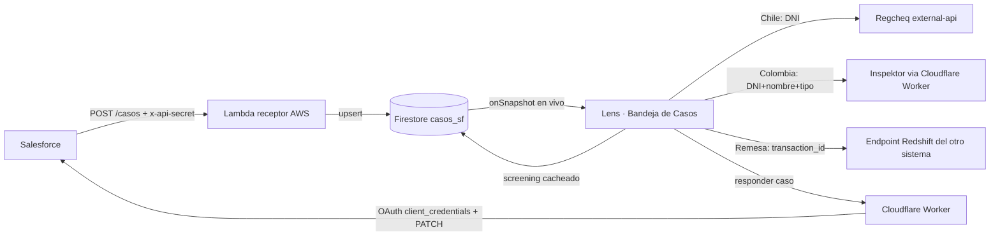

# Bandeja de Casos / Colas de trabajo — Arquitectura actual

> Documento de referencia del módulo **"Bandeja de Casos"** de Lens AI tal como está
> construido hoy. Objetivo: servir de base para diseñar la estructura futura de las
> colas de trabajo. Describe el pipeline completo (ingreso, clasificación,
> enriquecimiento, respuesta), el modelo de datos, la UI y las reglas de negocio.

---

## 1. Resumen ejecutivo

La Bandeja de Casos recibe **casos de compliance desde Salesforce** (coincidencias
OFAC/PEP y transacciones detenidas por bot), los muestra **en vivo** en Lens
clasificados en **colas de trabajo**, los **enriquece** consultando fuentes externas
(listas criminales y base de remesas), y permite **responder/resolver** el caso de
vuelta en Salesforce. El analista trabaja todo desde una sola pantalla.

Flujo de una punta a la otra:



---

## 2. Stack e infraestructura

| Capa | Tecnología | Detalle |
|---|---|---|
| Frontend | React 19 + TypeScript + Vite + Tailwind | SPA estática en **GitHub Pages** (`bmackenna-g66.github.io/lens-ai`) |
| Datos en vivo | **Firebase / Firestore** | Proyecto `lens-ai-9da63`. Colección `casos_sf`. Auth por Firebase (Google) |
| Endpoint de ingreso | **AWS Lambda + Function URL** | Cuenta `561521480266`, `us-east-1`. Stack SAM `casos-receptor-fnurl`, función `ofac-pep-trx-bot-receptor` (python3.12) |
| Proxy / backend liviano | **Cloudflare Worker** | `empresadocs-proxy.bmackenna.workers.dev`. Rutas para Inspektor y respuesta a Salesforce |
| Listas Chile | **Regcheq** | `external-api.regcheq.com` (partner key). Llamada directa desde el navegador |
| Listas Colombia | **Inspektor / Datalaft** | `inspektor.datalaft.com:2121/api`, vía Worker (`/inspektor`) por CORS |
| Remesas | **Redshift** (otro sistema) | Endpoint API Gateway del otro proyecto (`/remesas/search`), CORS habilitado para Lens |

> Nota: no se conecta a Redshift por TCP; el otro sistema expone un endpoint HTTP que
> internamente usa la **Redshift Data API**. Ver §7.

---

## 3. Flujo de ENTRADA — endpoint receptor (AWS)

**Código:** `aws/casos-receptor/` (SAM). Handler `src/app.py`.

- **Endpoint:** `POST https://<id>.lambda-url.us-east-1.on.aws/` (Function URL, no API Gateway).
- **Auth:** header `x-api-secret` (secreto compartido, en env var de la Lambda).
  Falta/incorrecto → `401`.
- **Body:** JSON, acepta **un objeto o un array** de casos. Todos los campos son
  **opcionales**; se aceptan campos extra.
- **Persistencia:** por cada caso hace **upsert en Firestore** (colección `casos_sf`,
  vía REST API + `google-auth`), usando el **"Número del caso" como ID del documento**
  (si no viene, genera `auto-<uuid>`).
- **Privacidad:** nunca loguea el payload (trae DNI); solo número y asunto.
- **Respuesta:** `200 {"ok": true, "recibidos": N, "guardados": K}`.

### Campos conocidos del payload (Salesforce → caso)

```
Nombre de la cuenta, Asunto, Fecha/Hora de apertura, Abierto, Cerrado,
Número del caso, Id interno del usuario, Número de DNI, Nombre, Apellido,
País Origen, País, Tipo de DNI, Nacionalidad, Propietario del caso
```

---

## 4. Modelo de datos — colección `casos_sf` (Firestore)

Un documento por caso. Escrito por la Lambda; el campo `screening` lo escribe Lens.

```jsonc
{
  // Promovidos por la Lambda para listar/filtrar rápido:
  "numeroCaso": "02188334",
  "asunto": "Coincidencia OFAC",
  "nombreCuenta": "…",
  "pais": "Chile",
  "recibidoEn": "2026-08-03T20:08:55Z",   // ISO, lo pone la Lambda
  "origen": "salesforce",

  // Payload completo tal cual llegó de Salesforce:
  "datos": {
    "Número del caso": "02188334",
    "Asunto": "Coincidencia OFAC",
    "Nombre": null,
    "Apellido": "jboada.cl3@global66.tech",   // OJO: hoy llega el correo acá (ver §11)
    "País": "Chile",
    "País Origen": "…",
    "Número de DNI": "141948911",
    "Tipo de DNI": "RUT",
    "Nacionalidad": null,
    "Propietario del caso": "katherine.araya@global66.com",
    "Fecha/Hora de apertura": "2026-06-12T17:20:15",
    "…": "cualquier otro campo que mande Salesforce"
  },

  // Screening cacheado (lo escribe Lens tras consultar la lista; ver §6):
  "screening": {
    "estado": "ok" | "sin_causas" | "na" | "error",
    "fuente": "Regcheq" | "Inspektor" | "—",
    "delitosUnicos": 3,
    "decision": "REVISAR (UCR)",           // conclusión del motor
    "razon": "…",
    "coincidencias": [
      { "tipo": "HURTO", "detalle": "RUC 1200-2023", "estado": "Vigente",
        "fecha": "2023-05-01", "fuente": "JG Santiago", "riesgo": "MEDIO" }
    ],
    "screenedAt": "2026-08-04T14:00:00Z"
  }
}
```

> El `screening` **se comparte entre analistas** y **sobrevive recargas** (no se
> re-consulta la lista al recargar). Los errores no se cachean (se reintentan).

---

## 5. Clasificación en colas (por `Asunto` y `País`)

En la UI los casos se agrupan en **3 colas** (tabs). La clasificación es por el
**Asunto** del caso:

| Cola | Criterio (sobre `asunto`) | Descripción |
|---|---|---|
| **Coincidencia OFAC** | `asunto` == `"Coincidencia OFAC"` (exacto, case-insensitive) | Casos OFAC/PEP |
| **Remesa** | `asunto` matchea `/DETIENE\s+TX/i` (ej. "COMPLIANCE BOT DETIENE TX 14128389 POR BENEFICIARIO CON MARCA OFAC") | Transacciones detenidas por bot |
| **Otros** | cualquier otro (catch-all) | Solo aparece si hay casos sin clasificar; garantiza que nada se pierda |

- Cada cola es una **tabla ordenada por fecha de llegada** (FIFO, ascendente por defecto).
- Las **columnas son dinámicas**: se muestra la unión de todos los campos presentes en
  `datos` de los casos de esa cola, más columnas derivadas específicas por cola (ver §6/§7).
- **Orden por columna:** todas las columnas son clickeables (asc/desc).
- **`País`** (campo `datos["País"]`) determina **qué lista** consultar en la cola OFAC
  (ver §6). ⚠️ Se usa `País`, NO `País Origen`.

### Columna derivada de la cola Remesa: `remesa`
El número de transacción se **extrae del Asunto** con `/TX\s*(\d+)/i` y se muestra en
una columna propia `remesa` (solo el número, ej. `14128389`).

---

## 6. Enriquecimiento de la cola OFAC — screening criminal en vivo

Cada caso OFAC se consulta contra la lista que corresponde a su **`País`**:

| País | Fuente | Requiere | Módulo reutilizado |
|---|---|---|---|
| Chile (`chile`/`cl`) | **Regcheq** | solo DNI | `lens360Service.screenChileCriminal()` (reusa el fetch a Regcheq + `evaluateCriminal` con el catálogo del Criminal Profiler) |
| Colombia (`colombia`/`co`) | **Inspektor** | DNI + nombre completo + tipo de DNI | `analyzeCriminalProfile()` + `evaluateLegalPolicy()` (modelo criminal Colombia, Capas 1-6) vía Worker |
| Otro | — | — | estado `na` ("No aplica") |

**Servicio orquestador:** `services/casosCriminalService.ts`
- `screenCaso(caso)` → enruta por país y devuelve `CasoScreening`:
  `{ estado, fuente, delitosUnicos, decision, razon, coincidencias[] }`.
- `runPool(items, worker, 4)` → **concurrencia limitada a 4** para no disparar
  cientos de llamadas de golpe (colas grandes, ~150 casos).

**Columnas nuevas en la tabla OFAC:** `Delitos únicos` y `Conclusión` (coloreada por
decisión: rojo bloqueo/prioritaria, ámbar revisar, verde liberar).

**Definiciones actuales:**
- `delitosUnicos`: Chile = causas distintas (dedupe por RUC); Colombia = `distinct_event_count` del modelo.
- `decision` (conclusión): Chile = decisión del motor (`preEvaluation.decision`);
  Colombia = recomendación (`Liberar` / `Revisar` / `Revisión prioritaria`).

**Ficha (detalle del caso):** al seleccionar una fila se muestra el panel
"⚖️ Perfil criminal" con la **lista de coincidencias/delitos** (tipo, detalle, estado,
fecha, fuente, riesgo) + botón **"↻ Reconsultar"**.

**Persistencia:** el resultado se guarda en `casos_sf.<caso>.screening` (§4). Al abrir
la bandeja, el estado se **siembra** desde ahí y **solo se consultan los casos sin
screening previo**.

---

## 7. Enriquecimiento de la cola Remesa — datos de Redshift

**Servicio:** `services/remesasService.ts`
- `buscarRemesa(txId)` → una remesa (para la ficha).
- `buscarRemesas(ids[])` → lote (para poblar la tabla; hasta 50 IDs por llamada, se
  parte en tandas).
- Endpoint: `POST https://<id>.execute-api.us-east-1.amazonaws.com/remesas/search`
  con `{ transaction_id }` o `{ transaction_ids: [...] }`. **CORS ya habilitado** para
  el origin de Lens → se llama directo, sin Worker. Sin auth hoy.
- Maneja: `not_found`, `cluster_unavailable` (viene con HTTP 200 + error en el body).

**Respuesta (por remesa):** `transaction_id, customer_id, beneficiary_name,
beneficiary_dni, beneficiary_dni_type, tipo_envio, origin_country, destiny_country,
destiny_amount_usd, tx_status, start_date, …`

**Columnas nuevas en la tabla Remesa:** `remesa`, `Beneficiario`, `DNI`, `Tipo de envío`
(pobladas en lote desde Redshift). La **ficha** muestra el detalle completo.

---

## 8. Flujo de SALIDA — responder / resolver el caso en Salesforce

Desde la ficha, panel **"Responder en Salesforce"**.

- **Servicio:** `services/salesforceCaseService.ts` → `sendCaseUpdate(payload)`.
- Va por el **Cloudflare Worker** (ruta `POST /salesforce/case-update`) porque el
  navegador no puede guardar el `client_secret` ni hacer el OAuth (CORS). El Worker
  hace **OAuth `client_credentials`** (secrets `SF_CLIENT_ID`/`SF_CLIENT_SECRET`) y
  luego **`PATCH`** al Apex REST `…/services/apexrest/compliance/case-update/v1/`.
- **Mantenedor de campos:** `services/salesforceCaseFields.ts` — única fuente de verdad
  de los campos del case-update, con sus **nombres de API, tipo y valores válidos**
  (picklists). El formulario se genera dinámicamente desde ahí. Para agregar/cambiar un
  valor se edita **solo ese archivo**.

Campos (todos picklist salvo indicado): `C_Review__c`, `Senales_de_Alerta__c`,
`C_Status__c`, `Status`, `CAT_CMPL__c`, `Sleep__c`, `Country__c`, `Product__c`,
`Tipo_de_Caso_Compliance__c`, `Type`; `Comments` (textarea); `PEP__c` (checkbox);
`CaseNumber`, `Customer ID` (texto). El envío **omite los campos vacíos**.

---

## 9. UI — componente `components/CasosInbox.tsx`

- **Tabs de colas** con contador. Al cambiar de cola se limpia la selección.
- **Filtro** por texto dentro de la cola (número, asunto, cuenta, país, remesa).
- **Tabla** con scroll horizontal, columnas dinámicas + derivadas, **orden por
  cualquier columna** (indicadores ↕/↑/↓), indicador **"en vivo"**.
- **Selección + borrado masivo:** checkbox por fila + "seleccionar todo" (sobre la
  vista actual), barra con **confirmación en 2 pasos**. Borra en Firestore por lotes
  (`writeBatch`). Es limpieza de bandeja (los casos se cierran en Salesforce).
- **Ficha (detalle):** al clickear una fila se abre debajo, con:
  - panel de screening criminal (cola OFAC) — §6,
  - panel de datos de remesa (cola Remesa) — §7,
  - tabla del payload completo (`datos`),
  - panel "Responder en Salesforce" — §8.

---

## 10. Servicios y responsabilidades (archivos)

| Archivo | Responsabilidad |
|---|---|
| `services/casosService.ts` | Lectura en vivo (`subscribeCasos` → `onSnapshot`), tipo `CasoSF`, `guardarScreening` (persistir), `eliminarCasos` (borrado por lote) |
| `services/casosCriminalService.ts` | Orquesta el screening por país (`screenCaso`), `esScreenable`, `runPool` (concurrencia); mapea coincidencias unificadas |
| `services/remesasService.ts` | Consulta de remesas en Redshift (`buscarRemesa`, `buscarRemesas`) |
| `services/salesforceCaseService.ts` | Respuesta a Salesforce (`sendCaseUpdate`) vía Worker |
| `services/salesforceCaseFields.ts` | **Mantenedor** de campos/picklists del case-update |
| `services/lens360Service.ts` | `screenChileCriminal` (Regcheq + motor) reutilizado por la cola |
| `services/colombiaCriminalModel.ts` + `legalPolicyGate.ts` | Modelo criminal Colombia (reusado por Inspektor) |
| `components/CasosInbox.tsx` | Toda la UI de la bandeja/colas |
| `aws/casos-receptor/` | Endpoint de ingreso (SAM/Lambda) |
| `cloudflare/empresadocs-proxy/` | Worker: rutas Inspektor y `salesforce/case-update` |

---

## 11. Limitaciones conocidas / pendientes

1. **Nombre vs correo (dato de origen):** hoy Salesforce envía el **correo en el campo
   `Apellido`** y `Nombre` vacío. Lens muestra lo que llega. Afecta la vista y, sobre
   todo, el **screening de Colombia (Inspektor)** que necesita el nombre real. Fix es en
   el origen (mapeo de Salesforce). Safeguard actual: si el "nombre" es un correo, no se
   usa como nombre en Inspektor.
2. **"Delitos únicos":** definición actual = causas distintas por RUC (Chile) /
   `distinct_event_count` (Colombia). A confirmar si debe ser "tipos de delito distintos".
3. **Sin TTL del screening:** el cacheado no se refresca solo; solo con "Reconsultar".
   Se puede agregar vencimiento (ej. re-consultar si tiene > N días).
4. **Endpoint de remesas sin auth** (lo expone el otro sistema). Se puede sumar API key.
5. **Latencia:** Regcheq/Inspektor tardan segundos por caso; con colas grandes la carga
   inicial es progresiva (concurrencia 4, incremental).
6. **Re-ingesta:** si Salesforce reenvía un caso ya borrado/screeneado, la Lambda hace
   upsert por Número de caso; un reenvío puede sobrescribir el doc (y su `screening`).

---

## 12. Reglas de negocio clave (para la estructura futura)

- **ID del caso** = "Número del caso" (dedup natural entre ingreso y respuesta).
- **Ruteo de lista** = campo `País` (Chile→Regcheq, Colombia→Inspektor).
- **Cola** = por `Asunto` (OFAC exacto / Remesa por patrón TX / Otros).
- **`remesa`** = número de TX extraído del Asunto.
- **Conclusión** = decisión del motor criminal (ya existente, reutilizado, no duplicado).
- **Persistencia y colaboración** = todo el estado de trabajo (screening) vive en el
  caso en Firestore, compartido y en vivo entre analistas.

---

*Generado a partir del código en producción del repo `BMackenna-G66/lens-ai`.*
